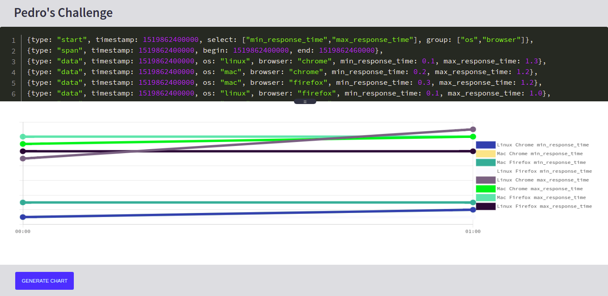

# About

A React Web App, part of the Intelie frontend challenge. It's an application that displays a line chart based on user input data similar to json.

# Running the App

### Requirements: Nodejs, internet browser.

### Tested browser compatibility: Opera, Google Chrome, Mozilla Firefox, Microsoft Edge.

- Open your terminal of choice
- Clone the repository with $git clone
- Run `$ npm install`
- Run `$ npm start`
- Check the browser address: localhost:3000/challenge-chart-plot
- Run tests using `$ npx cypress run` or `$ npx cypress open` if you want a graphic interface.

# Development Process and Documentation

[Documentation](https://docs.google.com/document/d/1Wzf1_pkbF6JB1XYYHdhcVrTJvzR50O2QlcdjnFK5WWI/edit?usp=sharing)

